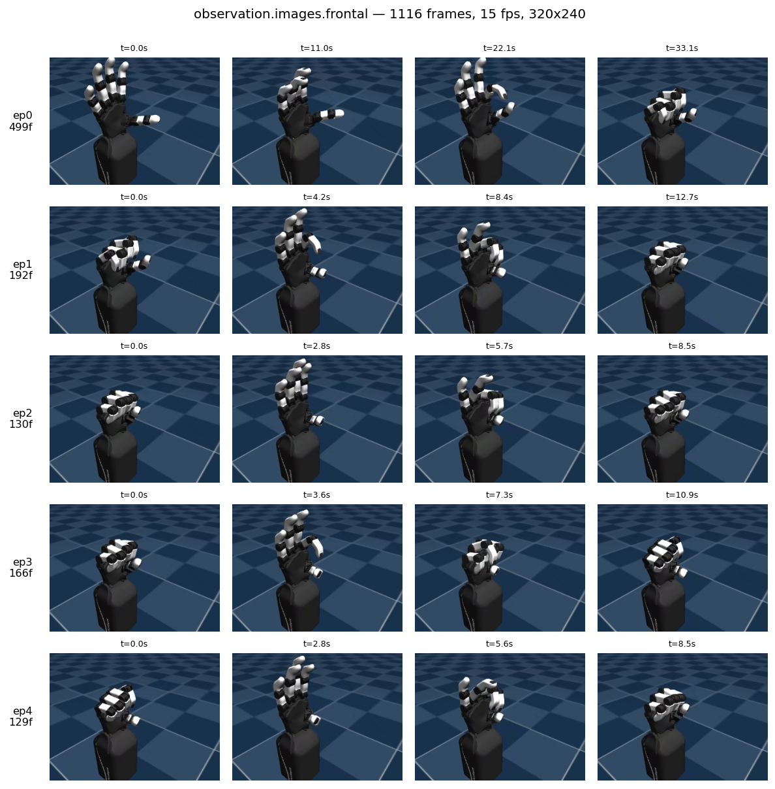
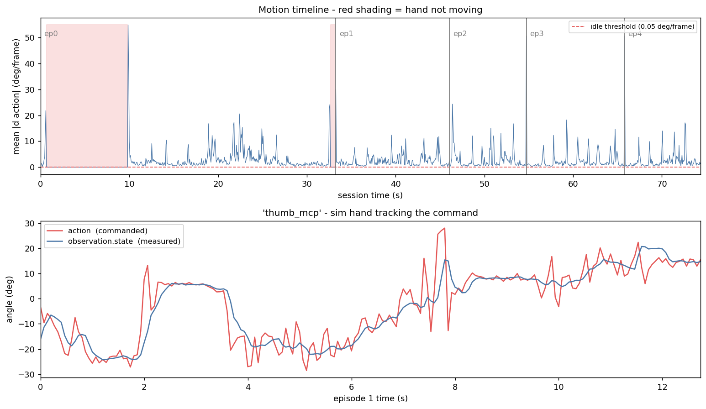

# 시뮬레이션 데이터 수집 보고서

| 항목 | 내용 |
| --- | --- |
| 작업 일자 | 2026-09-09 |
| 목표 | MuJoCo 시뮬 위에서 웹캠 텔레옵 시연을 LeRobot 데이터셋으로 수집 |
| 결과 | 5 에피소드 / 1116 프레임 / 15 fps 확보 (유효 4 에피소드) |
| 환경 | WSL2 / Ubuntu 24.04 / Python 3.12 / GPU 없음, CPU 렌더(llvmpipe) |
| 데이터셋 | `datasets/orca-sim-mediapipe`, LeRobot `v3.0`, 총 4.1 MB |

관련 문서: [웹캠 텔레옵 연동](webcam-teleop-report.md) · [시뮬 렌더 병목 해결](sim-render-bottleneck-report.md)

---

## 1. 요약 (TL;DR)

- 사람 손을 웹캠으로 추적해 시뮬 ORCA 손을 조종하고, 그 과정을 **모방학습용 데이터셋**으로 기록했다.
- 한 프레임에 저장되는 것은 세 가지다. 시뮬 손의 **실제 관절 각도**(입력), MuJoCo **렌더 이미지**(입력), 리타게터가 **명령한 관절 각도**(정답).
- 렌더 병목을 해결(3.5 → 19 fps)한 뒤 `--fps 15`로 5개 에피소드를 수집했다.
- 품질 점검 결과 **에피소드 0은 앞 10초가 정지 구간**이라 제외 대상이다. 나머지 4개(617 프레임)는 양호하다.
- 손목(`wrist`) 관절은 MediaPipe 경로에서 값이 오지 않아 **항상 0**이다. 현재 태스크에는 무해하나 인지하고 있어야 한다.

---

## 2. 수집 파이프라인

### 2.1 데이터 흐름

```
Orbbec RGB (/dev/video6, MJPEG)
  → MediaPipe Hand Landmarker (21점, world landmarks)
  → gRPC IngressServer (localhost:50051)          [landmarks_q]
  → Adaptive Analytical Retargeter (v1 URDF)      [actions_q]
  → TeleopActionMirror  ─┬→ SimSink.dispatch_action() → MuJoCo 스텝
                         └→ 녹화 루프가 스냅샷
  → LeRobotDataset (parquet + mp4)
```

핵심은 **텔레옵 경로와 녹화 경로가 분리**되어 있다는 점이다. 리타게터는 자기 속도(12~24 fps)로 액션을 만들어 `actions_q`에 넣고, 전용 컨슈머 스레드가 이를 꺼내 `TeleopActionMirror`에 최신값으로 덮어쓰면서 시뮬에 전달한다. 녹화 루프는 큐를 소비하지 않고 고정 `--fps` 주기로 미러를 **스냅샷**만 뜬다.

덕분에 리타게터가 느려져도 녹화 주기는 흔들리지 않는다. 대신 리타게터가 멈추면 미러가 마지막 값을 계속 반환하므로, 같은 포즈가 반복 기록되는 부작용이 있다 (6.3절).

### 2.2 에피소드 진행 순서

| 단계 | 동작 | 관련 로그 |
| --- | --- | --- |
| 1 | 2회차부터 `go_home()`으로 홈 포즈 복귀 후 5초 대기 | `Resetting hand to home position...` |
| 2 | 미러 초기화 및 `actions_q`의 낡은 명령 폐기 | — |
| 3 | 워밍업: 텔레옵 5연속 갱신 + 관측 5연속 성공 대기 | `Warming up sensors (teleop=n/5, ...)` |
| 4 | 준비 완료 → 시뮬 명령 전달 활성화, 기록 시작 | `Sensors ready — recording episode N` |
| 5 | SPACE 입력까지 `--fps` 주기로 한 행씩 기록 | — |
| 6 | 인코딩 및 저장 후 다음 에피소드 | `Episode N captured M frames.` |

**3단계가 통과해야 비로소 손이 움직인다.** 워밍업 중에는 `dispatch_enabled`가 꺼져 있어 의도적으로 시뮬에 명령을 보내지 않는다. 이 로그를 확인한 뒤 동작을 시작해야 낭비가 없다.

### 2.3 실행 명령

```bash
# usbipd로 카메라를 WSL에 연결한 상태여야 함 (Windows PowerShell)
#   usbipd attach --wsl --busid 6-3

cd ~/workspace/orca_teleop && source .venv/bin/activate
export ORCAHAND_DESCRIPTION_DIR=/home/keti/workspace/orcahand_description

python scripts/record_dataset.py \
  --backend sim --local --source mediapipe --show-video --overwrite --fps 15 \
  --urdf-path "$ORCAHAND_DESCRIPTION_DIR/v1/models/urdf/orcahand_right.urdf" \
  --repo-id keti/orca-sim-mediapipe \
  --task "wave and flex fingers" \
  --episode-end space --num-episodes 5 \
  --root "$HOME/workspace/orca_teleop/datasets/orca-sim-mediapipe"
```

| 옵션 | 의미 |
| --- | --- |
| `--backend sim` | 실물 손 대신 `orca_sim` MuJoCo 환경에 기록 |
| `--local --source mediapipe` | 웹캠 퍼블리셔를 별도 프로세스로 함께 기동 |
| `--fps 15` | 데이터셋 샘플링 주기. **실제 달성 가능한 값으로 맞춰야 한다** (7.1절) |
| `--episode-end space` | SPACE로 저장·다음 에피소드, `q`/`Esc`로 종료 |
| `--overwrite` | 기존 루트를 지우고 새로 시작. 없으면 루트 존재 시 오류 (6.2절) |

---

## 3. 저장되는 데이터

### 3.1 디렉토리 구조

```
datasets/orca-sim-mediapipe/
├── data/chunk-000/file-000.parquet        # 204 KB — 관절 각도 + 인덱스
├── videos/observation.images.frontal/
│   └── chunk-000/file-000.mp4             # 3.8 MB — AV1, 320x240, 15 fps
├── meta/
│   ├── info.json                          # 스키마, fps, 총 개수
│   ├── stats.json                          # 피처별 통계 (정규화용)
│   ├── tasks.parquet                       # 태스크 문자열 ↔ task_index
│   └── episodes/chunk-000/*.parquet        # 에피소드별 길이·구간·통계
└── images/                                 # 녹화 중 임시 PNG (저장 시 삭제됨)
```

영상은 프레임별 PNG로 쌓였다가 에피소드 저장 시점에 mp4로 인코딩되고 PNG는 지워진다. 녹화 도중 `images/`만 있고 `data/`·`videos/`가 없다면 **아직 저장 전**이라는 뜻이다.

### 3.2 한 프레임에 담기는 것

파케이 한 행이 한 프레임이다. 총 1116행 × 7열.

| 컬럼 | dtype | shape | 의미 | 학습 역할 |
| --- | --- | --- | --- | --- |
| `observation.state` | float32 | (17,) | 시뮬 손의 **측정** 관절 각도 (deg) | 입력 |
| `observation.images.frontal` | video | (240, 320, 3) | MuJoCo 렌더 RGB | 입력 |
| `action` | float32 | (17,) | 리타게터가 **명령한** 목표 각도 (deg) | 정답 |
| `timestamp` | float32 | (1,) | 에피소드 시작 기준 경과 초 | 인덱싱 |
| `frame_index` | int64 | (1,) | 에피소드 내 프레임 번호 | 인덱싱 |
| `episode_index` | int64 | (1,) | 에피소드 번호 | 인덱싱 |
| `index` | int64 | (1,) | 데이터셋 전역 행 번호 | 인덱싱 |
| `task_index` | int64 | (1,) | `tasks.parquet` 참조 키 | 인덱싱 |

정책이 배우는 것은 **"이 이미지와 현재 관절 상태에서 어떤 각도를 명령해야 하는가"** 이다. `observation.state`는 물리 시뮬을 거친 결과이고 `action`은 사람 손에서 유래한 명령이라, 둘은 같지 않고 지연과 오차를 두고 따라간다 (5.3절).

### 3.3 17개 관절 순서

`observation.state`와 `action` 벡터의 인덱스 순서다. `meta/info.json`의 `features.action.names`와 동일하다.

```
 0 wrist        1 pinky_abd    2 pinky_mcp    3 pinky_pip    4 ring_abd
 5 ring_mcp     6 ring_pip     7 middle_abd   8 middle_mcp   9 middle_pip
10 index_abd   11 index_mcp   12 index_pip   13 thumb_cmc   14 thumb_abd
15 thumb_mcp   16 thumb_dip
```

`abd`는 벌림(abduction), `mcp`·`pip`·`dip`는 손가락 마디 관절, `cmc`는 엄지 뿌리 관절이다.

### 3.4 `meta/stats.json`

피처마다 `min`, `max`, `mean`, `std`, `count`와 분위수(`q01`, `q10`, `q50`, `q90`, `q99`)를 담는다. 학습 시 입력 정규화에 쓰이므로, 데이터를 편집하면 반드시 재계산해야 한다.

이미지는 픽셀 전체가 아니라 **채널별 1개 값**으로 요약된다 (shape `(3,1,1)`). 이번 데이터셋의 평균은 `[0.168, 0.245, 0.323]`으로, 파란 배경이 지배적인 장면과 일치한다.

---

## 4. 수집 결과

| 항목 | 값 |
| --- | --- |
| 에피소드 | 5 |
| 총 프레임 | 1116 |
| 기록 fps | 15 |
| 총 길이 | 74.4 초 |
| 태스크 | `wave and flex fingers` (1종) |
| 해상도 | 320 × 240 |
| 용량 | 4.1 MB (영상 3.8 MB + 데이터 0.2 MB) |

에피소드별 프레임 수: 499, 192, 130, 166, 129



---

## 5. 품질 점검

점검 도구를 `scripts/inspect_dataset.py`로 정리해 두었다.

```bash
.venv/bin/python scripts/inspect_dataset.py --root datasets/orca-sim-mediapipe \
  --plot docs/assets/dataset-episode-analysis.png
```



### 5.1 에피소드별 유효성

프레임 간 명령 변화량이 0.05°/frame 미만인 프레임을 "정지"로 본다.

| ep | 프레임 | 초 | 평균 움직임 | 정지 비율 | 판정 |
| --- | --- | --- | --- | --- | --- |
| 0 | 499 | 33.3 | 2.25 °/f | **29.5 %** | 의심 |
| 1 | 192 | 12.8 | 2.43 °/f | 0.0 % | 양호 |
| 2 | 130 | 8.7 | 2.89 °/f | 0.0 % | 양호 |
| 3 | 166 | 11.1 | 2.30 °/f | 0.0 % | 양호 |
| 4 | 129 | 8.6 | 2.42 °/f | 0.0 % | 양호 |

**에피소드 0은 앞쪽 약 10초가 통째로 정지**다. 녹화가 시작된 뒤 손을 움직이기 전 구간으로 보인다. 이대로 학습하면 정책이 "가만히 있기"를 과대 학습하므로 제외하거나 앞부분을 잘라내야 한다.

### 5.2 관절 사용 범위

| 관절 | min | max | range |
| --- | --- | --- | --- |
| `thumb_mcp` | -60.0 | 90.0 | 150.0 |
| `thumb_dip` | -55.0 | 86.9 | 141.9 |
| `middle_mcp` | -36.1 | 100.0 | 136.1 |
| `pinky_mcp` | -29.6 | 95.3 | 124.9 |
| `index_pip` / `pinky_pip` | -15.0 | 107.0 | 122.0 |
| ... | | | |
| `middle_abd` / `ring_abd` | -27.0 | 27.0 | 54.0 |
| **`wrist`** | **-0.0** | **-0.0** | **0.0** |

굽힘(MCP·PIP) 관절은 100° 이상 폭넓게 사용됐다. 벌림(abd)은 54~66°로 상대적으로 좁지만 정상 범위다.

**`wrist`만 범위가 정확히 0이다.** MediaPipe 경로가 손목 각도를 넘기지 않기 때문이다(`--quest-wrist`는 Quest 전용 옵션). 손가락 태스크에는 무해하나, 정책은 손목을 항상 0으로 예측하도록 학습된다. 손목 제어가 필요하면 Quest 소스를 쓰거나 리타게터에 손목 경로를 추가해야 한다.

### 5.3 추종 성능

| 지표 | 값 |
| --- | --- |
| 평균 절대 오차 | 8.22° |
| 중앙값 오차 | 2.01° |
| 최적 지연 (`thumb_mcp`) | 2 프레임 (133 ms) |
| 그때의 상관계수 | 0.899 |

평균과 중앙값의 큰 차이는 오차가 **급격한 동작 순간에 몰려 있다**는 뜻이다. 상시로 8도씩 어긋나는 것이 아니다.

위 그래프 아래쪽에서 빨간 선(명령)이 들쭉날쭉한 것은 MediaPipe 추적 노이즈이고, 파란 선(실측)이 매끄러운 것은 시뮬 물리가 저역 통과 필터처럼 작동하기 때문이다. 상관계수 0.90에 지연 133 ms는 텔레옵 데이터로서 정상적인 수치다.

---

## 6. 운용 시 주의사항

### 6.1 usbipd 연결

WSL2는 USB 카메라를 기본적으로 보지 못한다. 재부팅이나 `wsl --shutdown` 후에는 `/dev/video*`가 사라지므로 Windows에서 다시 붙여야 한다.

```powershell
usbipd attach --wsl --busid 6-3
```

`bind`(공유)는 영구적이라 최초 1회만 관리자 권한이 필요하다. 연결이 안 된 상태로 실행하면 `Webcam not found (scan N)`이 무한 반복된다.

### 6.2 `--overwrite` 없이는 이어붙지 않는다

`record_dataset.py`는 항상 `LeRobotDataset.create()`를 호출하고, 이 함수는 `mkdir(exist_ok=False)`를 쓴다. 따라서 루트가 이미 있으면 **이어붙는 것이 아니라 `FileExistsError`로 즉시 종료**된다. 중단된 실행이 남긴 빈 디렉토리도 마찬가지로 다음 실행을 막는다.

에피소드를 누적하려면 세 가지 방법이 있다.

| 방법 | 장점 | 단점 |
| --- | --- | --- |
| `--overwrite`로 매번 새로 | 간단 | 기존 데이터 소실. 누적 불가 |
| 세션마다 `--root` 분리 후 `merge_datasets()` | 스크립트 수정 불필요 | 디렉토리 관리 + 병합 단계 필요 |
| `--resume` 옵션 추가 | 같은 루트에 계속 누적 | 스크립트 수정 필요 (약 10줄) |

`--resume`은 LeRobot 쪽 준비가 이미 되어 있다. `create_episode_buffer()`가 `meta.total_episodes`에서, `save_episode()`가 `meta.total_frames`에서 번호를 이어받으므로, `create()` 대신 `LeRobotDataset(repo_id, root=...)`로 로드하기만 하면 에피소드 번호가 자연히 이어진다.

### 6.3 녹화 중 `q`/`Esc` 금지

웹캠 미리보기 창에서 `q`나 `Esc`를 누르면 **퍼블리셔 프로세스만** 종료된다. 녹화 루프는 계속 살아 있고 `TeleopActionMirror`는 마지막 액션을 계속 반환하므로, 손이 굳은 채 같은 프레임이 무한히 쌓인다. 저장은 SPACE, 종료는 터미널 `Ctrl+C`를 쓴다.

### 6.4 목표 fps 검증

`--fps` 값은 그대로 `meta/info.json`에 기록되지만, 스크립트는 **실제 달성 여부를 검증하지 않는다**. 달성하지 못하면 재생 속도가 어긋난 데이터셋이 된다. 에피소드 종료 시 `captured N frames` 로그를 `fps × 녹화 초` 와 비교해 확인하는 것이 안전하다.

---

## 7. 한계와 다음 단계

### 7.1 성능 상한

렌더 병목 해결로 `get_observation()`이 288 ms → 52.7 ms가 되어 상한이 19 fps로 올랐다. 다만 MediaPipe와 리타게터가 같은 CPU를 나눠 쓰므로 실효는 12~15 fps다. **`--fps 15`가 현재 환경의 현실적인 상한**이며, 그 이상은 GPU 패스스루나 네이티브 Linux가 필요하다. 상세는 [렌더 병목 보고서](sim-render-bottleneck-report.md) 참조.

### 7.2 데이터 양

현재 유효 데이터는 에피소드 1~4의 **617 프레임(약 41초)** 이다. ACT 같은 모방학습 정책을 제대로 학습시키려면 통상 수천~수만 프레임이 필요하므로, 최소 한 자릿수 이상 더 모아야 한다.

### 7.3 태스크 범위

시뮬 장면에 손만 있어 현재는 **손 모양 모방**만 학습 가능하다. 물체 조작 정책을 원하면 `OrcaHandRightCubeOrientation` 같은 물체가 포함된 환경으로 녹화해야 한다.

### 7.4 정리 작업

에피소드 0 제거는 재녹화 없이 처리할 수 있다.

```python
from lerobot.datasets.lerobot_dataset import LeRobotDataset
from lerobot.datasets.dataset_tools import delete_episodes

ds = LeRobotDataset("keti/orca-sim-mediapipe", root="datasets/orca-sim-mediapipe")
delete_episodes(ds, [0])
```

작업 후 `scripts/inspect_dataset.py`로 결과를 재확인한다.

### 7.5 학습

아직 미실행. `lerobot-train`으로 ACT 등을 학습할 예정이다.

---

## 부록: 데이터 확인 방법

| 목적 | 방법 |
| --- | --- |
| 통계·품질 점검 | `python scripts/inspect_dataset.py --root <경로> --plot <png>` |
| 영상 직접 보기 | `videos/observation.images.frontal/chunk-000/file-000.mp4` |
| 시뮬에 재생 | `python scripts/replay_dataset.py --backend sim --sim-env right --repo-id <id> --root <경로> --episode 1` |
| 원본 표 열람 | `pd.read_parquet('data/chunk-000/file-000.parquet')` |
| 그림 재생성 | `python docs/_gen_dataset_figs.py` |

> 영상은 AV1(`libsvtav1`)로 인코딩되어 OpenCV `VideoCapture`로는 디코딩되지 않는다. 프레임을 뽑아야 하면 `ffmpeg`나 PyAV를 쓴다.
