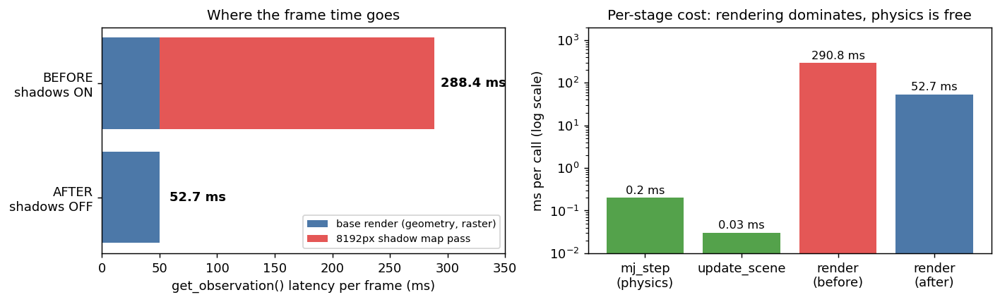
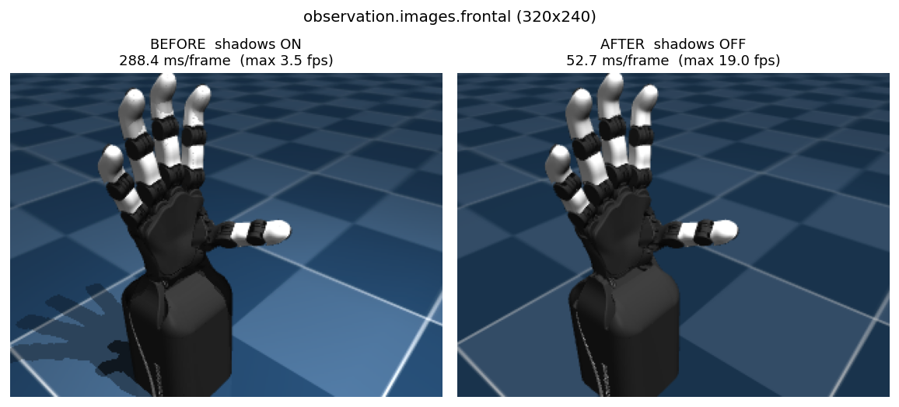

# 시뮬 렌더 병목 해결 보고서

| 항목 | 내용 |
| --- | --- |
| 작업 일자 | 2026-09-09 |
| 목표 | 데이터 녹화 속도가 목표 fps에 크게 못 미치는 원인 규명 및 해결 |
| 결과 | `get_observation()` 288.4 ms → 52.7 ms (**5.5배**), 녹화 상한 3.5 fps → 19.0 fps |
| 환경 | WSL2 / Ubuntu 24.04 / Python 3.12 / GPU 없음, CPU 렌더(llvmpipe) |
| 변경 파일 | `src/orca_teleop/sim.py` (+14) |

---

## 1. 요약 (TL;DR)

- `record_dataset.py --fps 30`으로 녹화했으나 실측 **3.7 fps**만 나왔다. `meta/info.json`에는 30이 기록되므로, 재생 시 8배 빨라지는 잘못된 데이터셋이 만들어지고 있었다.
- 프로파일링 결과 병목은 물리 연산이나 해상도가 아니라 **MuJoCo 씬의 8192px 그림자 맵**이었다. 프레임당 290.8 ms 렌더 시간 중 약 238 ms가 그림자 패스였다.
- 녹화용 오프스크린 렌더러에서만 그림자와 바닥 반사를 껐다. 조작자가 보는 MuJoCo 뷰어 화질은 그대로다.
- 수정 후 `--fps 15`로 **5개 에피소드 1116 프레임 녹화에 성공**했다.

---

## 2. 증상

`record_dataset.py`를 `--fps 30`으로 실행했을 때, 워밍업 단계의 관측 카운터가 5초에 6~7씩만 증가했다.

```
14:12:12 orca_teleop.recording | Warming up sensors (teleop=0/5, observations=1/5)
14:12:17 orca_teleop.recording | Warming up sensors (teleop=0/5, observations=7/5)
14:12:22 orca_teleop.recording | Warming up sensors (teleop=0/5, observations=14/5)
14:12:27 orca_teleop.recording | Warming up sensors (teleop=0/5, observations=21/5)
```

루프 한 바퀴에 약 0.7초가 걸린다는 뜻이다. 이 중 0.1초는 `HEARTBEAT_INTERVAL` sleep이므로 나머지 0.6초가 `get_observation()`이다.

녹화 중 임시 PNG 프레임 증가 속도를 직접 측정해 확인했다.

```
10초 전: 696 → 지금: 733 (증가 37, 약 3.7 fps)
```

리타게터는 `Retargeter | 12~24 fps`로 정상 동작 중이었으므로, 병목은 텔레옵 경로가 아니라 관측 경로에 있었다.

### 왜 문제인가

녹화 루프는 매 프레임 `sink.get_observation()`을 호출한다.

```python
# scripts/record_dataset.py
try:
    observation = sink.get_observation()
except Exception:
    ...
```

`RateTicker`는 목표 주기보다 **빠를 때 재우는** 역할이라 이 병목을 줄여주지 못한다. 결과적으로 `--fps 30`을 줘도 실제로는 3.7 fps로 기록되고, 메타데이터에는 30이 박히는 불일치가 발생한다.

---

## 3. 원인 분석

### 3.1 단계별 소요 시간 측정

`mujoco.Renderer`를 직접 호출해 구간별 비용을 분리했다 (v2 오른손 씬, 320×240, 20회 평균).

| 구간 | 시간 | 비고 |
| --- | --- | --- |
| `mj_step(nstep=5)` | 0.2 ms | 물리 |
| `update_scene` | 0.03 ms | 씬 그래프 갱신 |
| **`render`** | **290.8 ms** | **전체 비용의 99.9%** |

물리 연산은 병목과 무관했다. 모델 자체도 `nbody=22, ngeom=31, nlight=2`로 매우 가볍다.



### 3.2 범인: 8192px 그림자 맵

`orca_sim`의 씬 정의에 다음 설정이 있다.

```xml
<!-- orca_sim/src/orca_sim/models/v2/assets/scene.xml -->
<visual>
  <quality shadowsize="8192"/>
</visual>
...
<material name="groundplane" texture="groundplane" texuniform="true" texrepeat="5 5" reflectance="0.2"/>
```

광원 2개에 대해 8192×8192 그림자 맵을 매 프레임 렌더링한다. GPU라면 무시할 만한 비용이지만, WSL의 소프트웨어 렌더러(llvmpipe)에서는 치명적이다.

렌더 플래그를 조합해 기여도를 분리했다.

| 조건 | 시간 | 개선 |
| --- | --- | --- |
| 기준 (그림자 + 반사 ON) | 290.8 ms | — |
| 그림자 OFF | 63.8 ms | 4.8배 |
| **그림자 + 반사 OFF** | **49.9 ms** | **6.1배** |

### 3.3 기각한 대안

**(A) `shadowsize` 축소** — 8192에서 1024나 2048로 줄여도 1.5배 개선에 그쳤다. 비용이 맵 크기가 아니라 그림자 패스 자체(지오메트리 재렌더링 + 프래그먼트별 조회)에 있기 때문이다. 줄이는 것보다 끄는 것이 맞다.

| `shadowsize` | 시간 | 개선 |
| --- | --- | --- |
| 8192 (기본) | 290.8 ms | — |
| 2048 | 207.6 ms | 1.5배 |
| 1024 | 205.3 ms | 1.5배 |

**(B) 해상도 축소** — 그림자를 끈 뒤에는 해상도가 병목이 아니었다. 320×240과 160×120이 사실상 동일하다. 화질을 희생할 이유가 없어 320×240을 유지했다.

| 해상도 | 시간 |
| --- | --- |
| 320×240 | 53.3 ms |
| 256×192 | 64.1 ms |
| 160×120 | 49.8 ms |

**(C) `scene.xml` 직접 수정** — 조작자가 보는 MuJoCo 뷰어까지 그림자를 잃게 된다. 또한 `orca_sim`은 다른 용도로도 쓰이는 공유 레포이므로 건드리지 않았다.

---

## 4. 조치

녹화용 오프스크린 렌더러에만 렌더 플래그를 적용했다. 뷰어는 별도의 GL 컨텍스트를 쓰므로 영향을 받지 않는다.

`src/orca_teleop/sim.py`:

```python
@dataclass(frozen=True)
class SimCameraConfig:
    name: str = "frontal"
    width: int = 320
    height: int = 240
    # Shadows and floor reflections are off by default: they cost ~250 ms per
    # frame under software GL and are invisible at this resolution anyway.
    # Only the recorded observation is affected, never the operator's viewer.
    shadows: bool = False
```

```python
        self._renderer = mujoco.Renderer(
            env.model,
            height=self._camera_config.height,
            width=self._camera_config.width,
        )
        if not self._camera_config.shadows:
            # ``mjv_updateScene`` preserves these, so setting them once here is enough.
            scene_flags = self._renderer.scene.flags
            scene_flags[mujoco.mjtRndFlag.mjRND_SHADOW] = 0
            scene_flags[mujoco.mjtRndFlag.mjRND_REFLECTION] = 0
```

`mjv_updateScene`이 `scn->flags`를 보존한다는 점을 실험으로 확인했기 때문에, 매 프레임이 아니라 생성 시 한 번만 설정한다. 20회 `update_scene` 호출 후에도 플래그가 0으로 유지됐다.

GPU 환경으로 옮기거나 시각적으로 예쁜 영상이 필요하면 `SimCameraConfig(shadows=True)`로 되돌릴 수 있다.

---

## 5. 검증

### 5.1 성능

실제 `OrcaHandSimSink.get_observation()`을 20회 호출한 평균이다.

| 설정 | 프레임당 | 상한 |
| --- | --- | --- |
| `shadows=True` (기존) | 288.4 ms | 3.5 fps |
| `shadows=False` (신규 기본값) | **52.7 ms** | **19.0 fps** |

**5.5배 개선.**

### 5.2 화질

손 자체는 동일하고 바닥 그림자만 사라진다. 평균 절대 픽셀 차이는 11.3/255이며, 대부분 바닥 영역에서 발생한다. 정책 학습용 관측으로는 정보 손실이 없다.



### 5.3 테스트

```
$ .venv/bin/python -m pytest tests/test_sim_cameras.py -q
.....                                                     [100%]
5 passed, 2 warnings in 5.55s
```

### 5.4 실제 녹화 결과

수정 후 `--fps 15`로 재실행하여 정상적으로 데이터셋을 확보했다.

| 항목 | 값 |
| --- | --- |
| 에피소드 | 5 |
| 총 프레임 | 1116 |
| 기록 fps | 15 |
| 영상 길이 | 74.4 s |
| 해상도 | 320×240 |

에피소드별 프레임 수: 499, 192, 130, 166, 129

```
datasets/orca-sim-mediapipe/
├── data/chunk-000/file-000.parquet          # observation.state, action (17 관절)
├── videos/observation.images.frontal/
│   └── chunk-000/file-000.mp4               # MuJoCo 렌더
└── meta/{info,stats}.json, episodes/, tasks.parquet
```

---

## 6. 부수적으로 확인된 사항

이번 작업 중 함께 드러난, 코드 수정 없이 운용으로 회피 가능한 문제들이다.

| # | 증상 | 원인 | 대응 |
| --- | --- | --- | --- |
| 1 | 웹캠을 못 찾음 (`Webcam not found (scan N)`) | WSL2에 USB 카메라 미연결. `/dev/video*` 자체가 없었음 | Windows에서 `usbipd attach --wsl --busid 6-3` |
| 2 | `FileExistsError`로 스크립트 즉사 | `LeRobotDataset.create`가 `mkdir(exist_ok=False)`. 중단된 실행이 빈 루트를 남김 | `--overwrite` 사용 |
| 3 | 손이 마지막 포즈로 굳은 채 프레임만 쌓임 | 웹캠 창에서 `q`/`Esc`를 눌러 퍼블리셔만 종료됨. `action_mirror.snapshot()`이 마지막 액션을 계속 반환 | 녹화 중에는 `q` 금지, 저장은 `SPACE` |

### 6.1 usbipd 재연결

`attach`는 재부팅이나 `wsl --shutdown` 시 풀린다. `bind`(공유) 설정은 영구적이므로 매번 다음만 실행하면 된다.

```powershell
usbipd attach --wsl --busid 6-3
```

자동 재연결이 필요하면 `--auto-attach`를 붙여 창을 띄워둔다.

---

## 7. 남은 과제

- **여전히 30 fps는 불가능하다.** 상한이 19 fps이고 MediaPipe와 리타게터가 CPU를 나눠 쓰므로 실효 12~15 fps다. `--fps 15`를 기본으로 쓰되, 그 이상이 필요하면 GPU 패스스루 또는 네이티브 Linux가 필요하다.
- `record_dataset.py`가 목표 fps를 달성하지 못할 때 경고를 남기지 않는다. 실측 fps를 로깅하거나, 큰 괴리가 있으면 `meta/info.json`에 실측값을 기록하도록 개선할 여지가 있다.
- 렌더를 별도 스레드로 분리하면 관측과 텔레옵을 겹칠 수 있으나, 현재 15 fps로 충분해 보류했다.

---

## 부록: 그림 재생성

문서의 그림은 다음으로 재생성한다.

```bash
cd ~/workspace/orca_teleop && .venv/bin/python docs/_gen_render_figs.py
```
